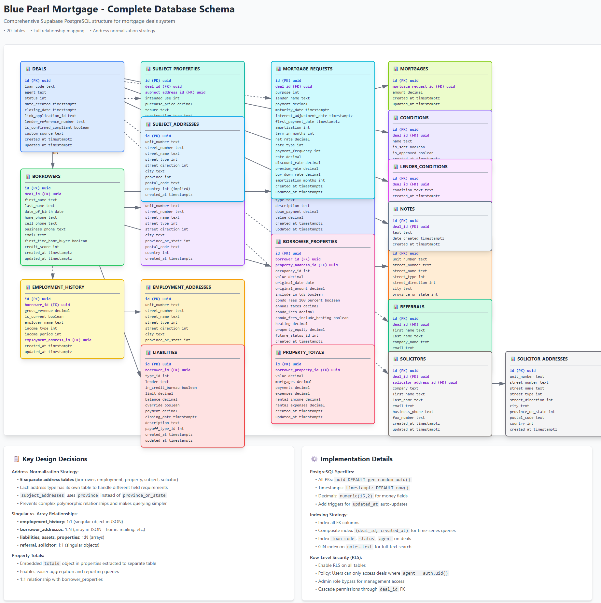

veetesh rup
12:08 PM (47 minutes ago)
to me

API DOCS
https://developer.newton.ca/velocity/v1/index.html#velocityapi--webhooks6

These API keys are stored in SF, so ideally we get them from there as that's where we keep it updated. Seems that a broker can only request their own deals using their own API key.

sample GET request using Garry's api key and VBLUE-112650 code
https://api-velocity.newton.ca/api/forms/v1/deals?apikey=fae6cdb1-f48e-406f-866a-e5090cca1fb9&loancode=VBLUE-112650

List of API keys:

csv
env_Variables\_\_c-12_8_2025.csv
5.27 KB · Download
To start:
We want to produce something like this as a PDF for the HOLP:
https://claude.ai/public/artifacts/ec3c1edd-1462-42d2-8258-27ca3c5c1917

Thinking it doesn't need to be an LLM call, a simple script should be sufficient for something like this where the template is there and just the dynamic data is populated (liabilities and mortgagerequested details).

But first focus is to set up all the tables

We'll likely have to create tables for all the enumerations also (https://developer.newton.ca/velocity/v1/index.html#enumerations) since the json just gives us the shortcode values but we want out database to have the full descriptions.

Updated artifact:

